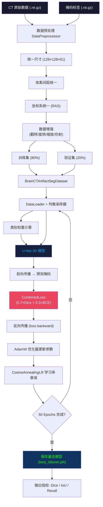

# 训练过程流程图 & 神经网络架构图

> 老师要求：最终成果物中需包含这两张图。

## 一、训练过程流程图



## 二、U-Net 3D 神经网络架构图

```mermaid
graph TD
    subgraph 编码器（下采样）
        IN["输入: 1×128×128×61"] --> EC1["DoubleConv3D<br/>1 → 16<br/>128×128×61"]
        EC1 --> D1["MaxPool3D<br/>16 → 32<br/>64×64×30"]
        D1 --> EC2["DoubleConv3D<br/>32→32<br/>64×64×30"]
        EC2 --> D2["MaxPool3D<br/>32→64<br/>32×32×15"]
        D2 --> EC3["DoubleConv3D<br/>64→64<br/>32×32×15"]
        EC3 --> D3["MaxPool3D<br/>64→128<br/>16×16×7"]
        D3 --> EC4["DoubleConv3D<br/>128→128<br/>16×16×7"]
    end

    subgraph 瓶颈层
        EC4 --> BN["DoubleConv3D<br/>128→128<br/>16×16×7"]
    end

    subgraph 解码器（上采样）
        BN --> DC4["ConvTranspose3D ↑<br/>128→64<br/>32×32×15"]
        EC3 -.->|"跳跃连接 torch.cat"| DC4
        DC4 --> UC4["DoubleConv3D<br/>128→64<br/>32×32×15"]

        UC4 --> DC3["ConvTranspose3D ↑<br/>64→32<br/>64×64×30"]
        EC2 -.->|"跳跃连接 torch.cat"| DC3
        DC3 --> UC3["DoubleConv3D<br/>64→32<br/>64×64×30"]

        UC3 --> DC2["ConvTranspose3D ↑<br/>32→16<br/>128×128×61"]
        EC1 -.->|"跳跃连接 torch.cat"| DC2
        DC2 --> UC2["DoubleConv3D<br/>32→16<br/>128×128×61"]
    end

    subgraph 输出层
        UC2 --> OUT["Conv3D 1×1×1<br/>16 → 1"]
        OUT --> MASK["输出: 二值掩码<br/>1×128×128×61"]
    end

    style IN fill:#1a1a2e,color:#fff
    style MASK fill:#1a1a2e,color:#0f0
    style BN fill:#16213e,color:#0af
```

## 三、组件说明

| 组件 | 文件 | 功能 |
|------|------|------|
| 数据预处理 | `DataPreprocessor.py` | 统一尺寸/体素/坐标 + 数据增强 |
| 数据集类 | `BrainCTArtifactSegDataset.py` | 加载 CT+掩码配对数据 |
| 模型 | `UNet3D.py` | 标准3D U-Net，1.4M参数，62层 |
| 损失函数 | `CombinedLoss.py` | Dice Loss + BCE Loss 混合 |
| 训练器 | `SegTrainer.py` | 训练循环 + 验证 + 模型保存 |
| 评估指标 | `MetricUtils.py` | Dice / IoU / Recall |
| 主入口 | `SegMain.py` | 组装所有组件 |

## 四、关键参数

| 参数 | 值 | 说明 |
|------|----|------|
| 输入尺寸 | 128×128×61 | 原始512×512×247缩放64倍 |
| 基础通道数 | 16 | 第一层DoubleConv通道 |
| Batch Size | 1 | 受限于3D数据体积 |
| 优化器 | AdamW | lr=1e-3 |
| 学习率策略 | CosineAnnealing | T_max=50 |
| Epoch | 50 | |
| 损失权重 | Dice:BCE = 7:3 | 侧重分割精度 |
| 推理阈值 | 0.35 | 二值化阈值 |
